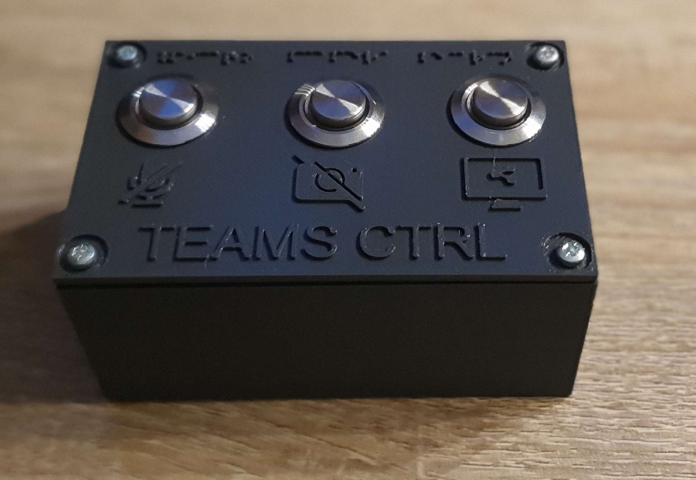

# Teams Control Pannel
Le but de ce projet est de pouvoir intéragir avec Teams, même si vous n'êtes pas sur l'application.\
De plus, le fait d'avoir une interface physique peux faciliter l'utilisation de l'application par les utilisateurs Teams légèrement dépassés lors de présentation.

# Instructions
Dezipper `Interaction_Teams/libopenblas.FB5AE2TYXYH2IJRDKGDGQ3XBKLKTF43H.gfortran-win_amd64`\
Modifier le `YOUR_PATH` en inserant le path du fichier `Interaction_Teams` dans le fichier `Teams_Control/Teams_Control.ino` à la ligne 63, 79 & 93.
